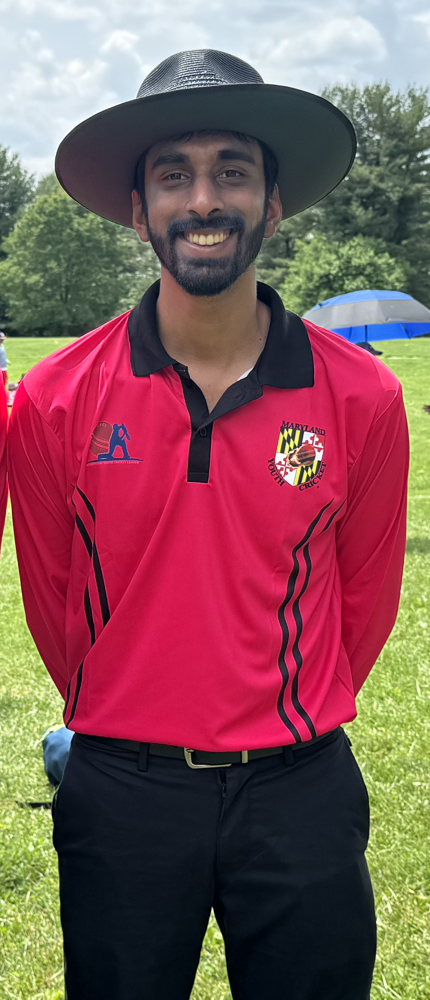
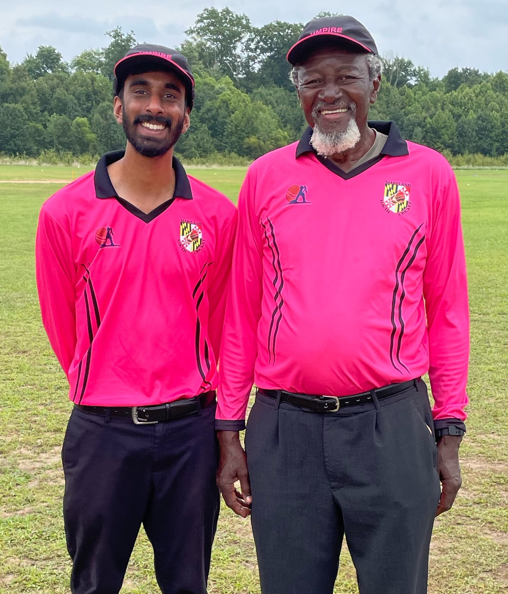
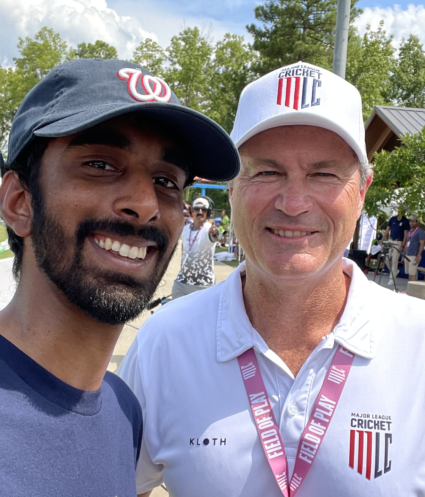
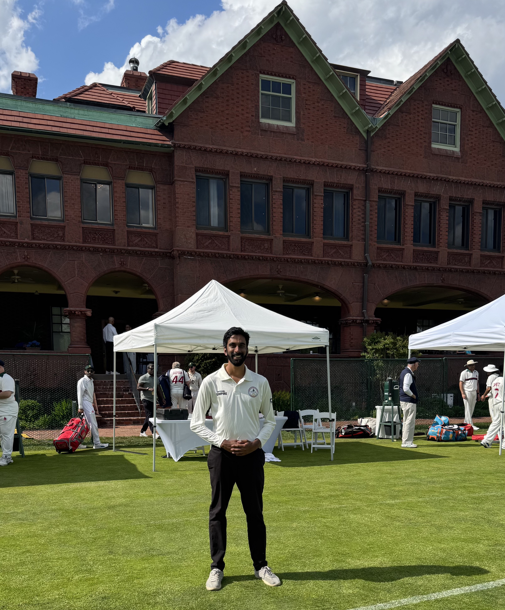

## Cricket umpiring

    <!-- 

        
    
 -->
    

        

            Outside of work, I am an aspiring cricket umpire. I am internationally certified (Level 3 - WICUA and <a href="https://usacusa.org" target="_blank">USACUSA</a>) and umpire around the Washington, D.C. area and east coast region. I was named <strong>Emerging Umpire of the Year - 2024</strong> 🏆 by the Washington Cricket League. I have stood in hundreds of matches from local and youth leagues to USA cricket selection tournaments and ICC sanctioned tournaments.
        

        

            

                
                
with Steve Bucknor

            

            

                
                
with Simon Taufel

            

            

                
                
at Merion Cricket Club

            

        

    

## Travel Highlights

Some of my favorite places I've been (and some photos).
<iframe src="https://www.google.com/maps/d/embed?mid=1TzrOtEELnJyQR4Vck3LnGvn-ACealAE&ehbc=2E312F&noprof=1" width="640" height="480"></iframe>
