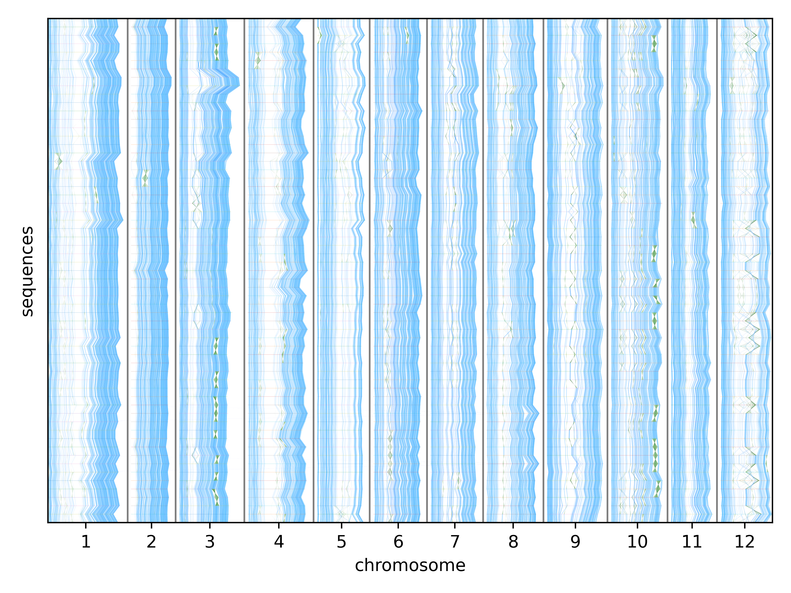

You can also find my articles on [my Google Scholar profile](https://scholar.google.com/citations?user=LiuMoYgAAAAJ&hl=en).

## Nanopore signal classification with pangenome indexes

Nanopore sequencing generates reads by measuring electrical current signal that is converted to nucleic acid sequences typically with a neural network. This basecalling step is a bottleneck in real-time classification pipelines. We developed a novel nanopore signal-based read classification method that uses the [r-index](https://www.cell.com/iscience/fulltext/S2589-0042(21)00664-7?_returnURL=https%3A%2F%2Flinkinghub.elsevier.com%2Fretrieve%2Fpii%2FS2589004221006647%3Fshowall%3Dtrue), a full-text index that scales to pangenomes. This method, **Sigmoni**, is significantly faster and more accurate than existing methods for classifying nanopore reads against large pangenomes.

- [Sigmoni paper](https://doi.org/10.1093/bioinformatics/btae213) ([pdf](https://academic.oup.com/bioinformatics/article-pdf/40/Supplement_1/i287/58354790/btae213.pdf)), published in 2024 in Bioinformatics (ISMB 2024)

- 🏆 **RECOMB-seq Best Poster/Short Talk** - [RECOMB-seq talk recording](https://www.youtube.com/watch?v=Gzm2fMEtmUI), in Istanbul, Türkiye (April 2023) 

- 🏆 **ISMB HitSeq Best Talk** - [ISMB talk recording](https://www.youtube.com/watch?v=S2lZv_ZH884) and [slides](http://vikshiv.github.io/files/sigmoni.pdf), in Montreal, Quebec (July 2024)

## Building and visualizing pangenomes

 Pangenomes require an underlying alignment for interpretability and usability. This structure can take the form of a multiple alignment or graph, but these are impractical to compute. We developed a novel method, **Mumemto**, to compute maximal unique matches (multi-MUMs), commonly used as anchors for alignment, at the scale of hundreds of human genomes. Mumemto can visualize pangenome synteny (example below), accelerate graph construction, identify misassemblies, and even improve full-text index-based classification ([see further work](https://www.biorxiv.org/content/10.1101/2024.10.29.620953v1.full.pdf)).

- [Mumemto paper (open access)](https://genomebiology.biomedcentral.com/articles/10.1186/s13059-025-03644-0), published in 2025 in Genome Biology

- 🏆 **ISMB EvolCompGen Best Poster** - [poster (large file, 25 MB)](http://vikshiv.github.io/files/mumemto_ismb_poster_a0.pdf), in Liverpool, UK (July 2025) 

- Follow-up paper available on BioRxiv : [Partitioned Multi-MUM finding for scalable pangenomics](https://www.biorxiv.org/content/10.1101/2025.05.20.654611v1)

- Software on [github](https://github.com/vikshiv/mumemto)

    
    
potato pangenome (<a href="https://www.nature.com/articles/s41586-024-08476-9">ref</a>)

